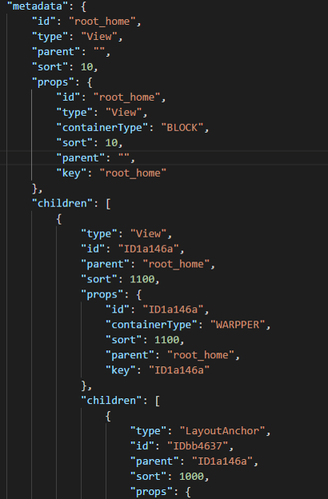
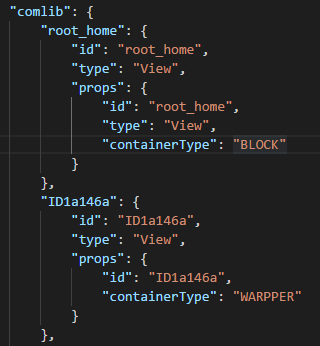
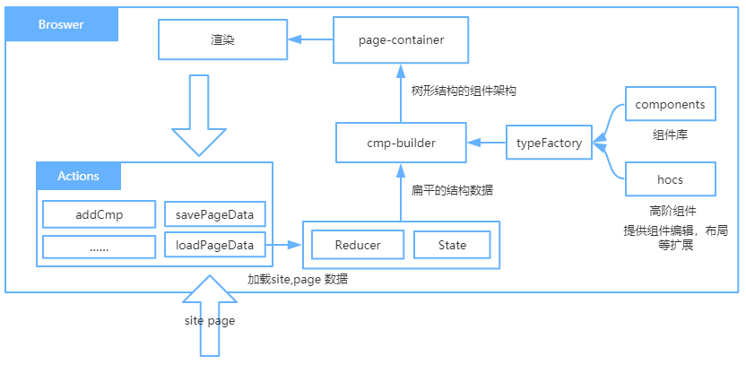
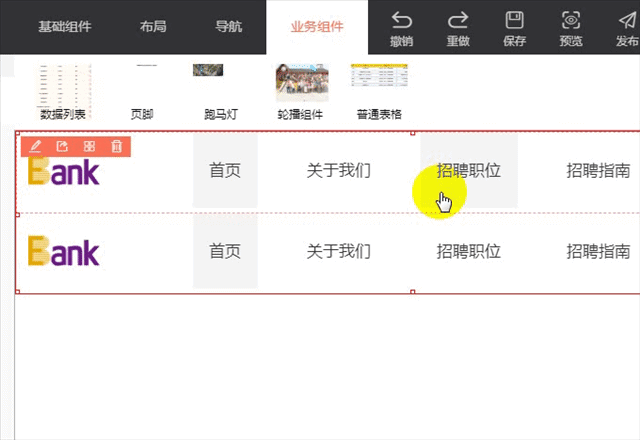
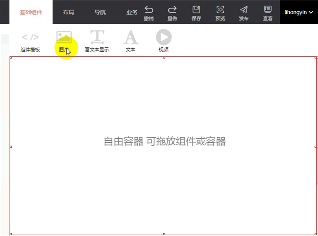
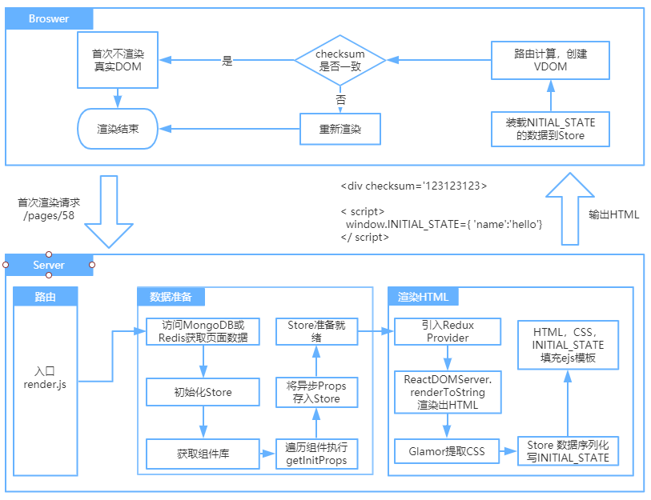
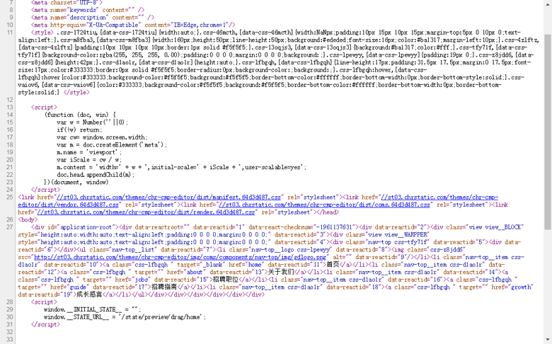

# 基于 React 的可视化编辑平台实践

> 本文主要介绍了基于 React 构建可视化编辑平台的实践，包括对可视化拖拽布局、在线编辑、同构直出的实现。

## 背景

目前，HRG 的英才校园在线招聘业务有大量的企业定制化需求，企业在英才校园做招聘，同时也希望有自己的招聘主页，每年都会招聘一部分兼职同学来开发这类的招聘主页，这类招聘主页通常不复杂，但是如果全部需要前端同学实现的话，还是很耗时费力的，我们希望能通过技术手段不断的提升这类业务的交付效率。

## 提效规划

定制页相关的项目，早期是通过静态页来做的，纯静态页对开发者来说上手容易，但是很难做组件化，上线流程完全靠手工，成本太高，所以我们计划逐步推进通过可视化编辑提升效率。

项目整体分了两期：

一期，实现了可视化的在线编辑、发布，支持流式布局、绝对定位布局、同构直出、动画，提供了通用的组件库。

二期，支持组件可扩展，提供组件开发工具，组件市场，三期仍在完善阶段，暂未发布。

## 系统演示

首先看下我们的系统演示，然后再逐步分析深入，主要是可视化编辑系统开发思路，以及关键模块的实现。

## 系统维度分析

针对可视化编辑平台，我们做了一些调研，有一些思想我们觉得挺有意义，这里分享一下，参考文章见参考文献。

我们的系统，对标上面的维度应该下面三项：

### 系统功能
**Component Tree 编辑，核心功能为页面可视化布局设计**

页面由组件组成，组件可以支持嵌套，目前组件是通用的组件，后期会支持扩展，组件可以承载业务逻辑。

提供了拖拽布局支持，支持流式布局，绝对定位布局。

### 面向客群
**前端小白，核心诉求是交互性高，所见即所得的编辑方式**

目前是组内兼职的同学在用，有一定的前端布局基础，理解每个组件的使用方式。

如果想降低对用户的要求，比如对普通用户，那么就要提供模板支持，对普通用户而言，改改背景图，换个图片，编辑下文字就够用了，越是要降低对用户的要求，越是要固化一些设计和数据模型。

### 编辑自由度
**前端框架组件，依赖工具提供组件，编辑效率高，业务逻辑封装度高**

目前系统的自由度是组件级别，内置了通用的组件，包括：

- 基础组件：图片、文本、表格、模板组件
- 复杂组件：数据列表、跑马灯、轮播图、表格
- 布局：锚点布局、标准布局、选项卡布局
- 容器：上下流（块），左右流（内联块），自由容器（绝对定位布局）

这些组件是内置到系统的，二期的组件市场，目标是组件可扩展，组件可以承载业务，业务逻辑封装度更高些，方便使用。

## 技术实现

系统采用技术栈如下：

前端：React + Redux + ImmutableJs + ReactDND + Antd 

后端：Node Express + MongoDB + Redis

**可视化布局**

首先，需要定义渲染UI的数据结构，通常这种UI的数据都是树形的结构，可以用一个大的 JSON 来表示，然后递归渲染。

类似如下的结构：

节点使用类似 React 的虚拟 DOM 结构：

- Type ：组件类型
- Props ：组件属性
- Children：组件的子节点列表
- Sort：排序号

由于直接使用树形的的结构，对节点的增删改查不友好，所有进行了扁平化处理，将树拆成了两个结构：

结构一：

存储节点的关系，类似一个数据库的二维表，描述节点的父子关系，方便修改父子结构，同级排序。

结构二：

存储节点的数据，通过 ID 可以获取节点数据，方便节点数据更新。

其次，定义好数据结构以后，就是渲染页面了，将上面的两个数据合并组成树形结构，然后递归遍历创建组件对象。

创建组件的时候，需要获取对应的组件类型，比如导航组件，轮播图组件，所以需要一个组件的类型映射表，根据组件的 Type 获取对应的类型，创建实例。

还有组件的布局能力，布局功能抽到容器里，所以组件在创建的时候会包裹对应的容器，组件的定位由容器负责，不同的容器提供不同的功能，容器由高阶组件提供。

如下图所示：

图中 typeFactory 负责组件的创建，创建组件的同时包裹对应的高阶组件，

这里是组件在编辑状态的渲染过程，发布以后，考虑的渲染的性能，预先创建了组件的树形结构。

最后，实现拖拽布局，布局完全是容器来负责，拖拽过程的位置检测由容器来实现，通过鼠标位置确定组件的安放位置，修改描述组件关系的数据，触发重新渲染。

流式布局演示：

自由布局演示：

**组件属性编辑**

前面说了组件的布局，除了布局，还要对组件的属性进行编辑，编辑也是通过容器来实现的，通过高阶组件来复用。

组件也需要遵守一个规范，方便获取组件的属性列表，为组件增加额外的静态属性来说明组件的属性说明。

系统提供了组件属性编辑器，同时可以支持扩展出其他自定义编辑器。

**同构直出**

因为定制页是需要 SEO 的，所以要做服务器端渲染，也就是要做同构直出。

做同构直出需要考虑以下内容：

- 全局的 Store（Redux）
- 组件内 CSS 抽取（Glamor）
- 针对 Node 端单独构建一个组件库，忽略组件内 less 的引用
- 设置 externals 避免包过大
- 组件内异步获取的数据，通过为组件加静态属性 getInitProps（参考Next框架）

Store 中存储了组件树和组件属性数据，直出的不仅仅是 HTML，还包括对应的 CSS，这里使用 css in js 方案 Glamor，渲染 HTML 的同时，也可以提取对应的 CSS。

下面是同构直出的大致流程：

同构直出的渲染结果：
 

为了减小首次渲染页面的体积，并没有把状态数据内嵌到页面里，而是提供了一个状态的的请求链接，异步加载状态数据。

一阶段完成以后，开始上线运行支持业务，目前已经支持 100+ 的定制页项目，通过在线编辑、修改、发布，节约了大部分编码、构建、发布的时间，开发效率大幅提升。

## 组件市场

由于一阶段是内置的组件库，包括通用组件以及定制页业务相关的组件，二阶段希望能实现组件可扩展，提升平台的应用范围，实现页面级的组件，增强易用性。

**组件市场**

组件市场是一个组件的集合，提供可选的组件，组件的粒度可以开发者控制，可以是组件级，也可以是页面级，可以内嵌业务，或者是通用的组件。

**组件开发CLI工具**

提供组件开发脚手架，本地开发、调试环境，可以发布组件到组件市场。

**组件动态加载**

为了动态加载组件，我们开发了模块加载器 BondJs，可以动态加载页面依赖的所有组件，将组件注册到系统里。

目前组件市场还处于完善阶段，计划年底上线，磨合一段时间，后期希望可以积累更多的模板，接入其他业务，能提升运营类项目的效率。

关于第二阶段的后续有机会可以再详细说明，这里不展开了。

## 易用性分析

目前平台是给内部开发者使用，因为编辑自由度高，需要有一定的前端基础，系统也提供了模板功能，直接从模板编辑相对易用一些，不过，仍是对页面内元素的编辑，对运营/产品/企业用户来说还是有一定的难度。

对普通用户来说，最容易懂的模型不是页面的元素，而是业务模型，比如用户信息、企业信息、职位信息这一类更贴近用户的模型，所以后期组内同学和后端同学一起开发基于后端模板的解决方案，这个方案的优点是可以利用企业招聘方的数据模型，比如企业介绍、职位列表等数据，再提供多个后端预置模板，企业只需要维护自己的信息，然后选择一个模板即可，可以满足对定制页要求不那么高的用户。

灵活性和易用性是需要平衡的，越灵活往往易用性比较差，一般是通过预定义来说提升易用性，细粒度的组件很灵活，但是易用性差，后续可以开发内嵌业务的页面级组件，来提升易用性。

## 总结

目前，整个编辑平台已经支持了 100+ 的项目，针对复杂度不高的项目可以很大提升开发效率，整个项目因为是 Side Project ，一边支持业务一边开发，所以花了不少时间，回过头来看，做这类项目，首先要有明确的目标和受众，是为开发者赋能，还是服务普通用户，可视化布局也不是银弹，所以要想好真正影响效率的地方。比如有些项目开发快，但是面对用户的频繁修改需求，效率也很难提升，反过来要控制用户的需求变更，如果客户要求不高，直接给个默认模板就可以，或者提供多样的选择，让用户选择相对满意的模板即可。

后期组件市场上线，希望可以接入不同的业务线，提供更多面向业务的组件或者页面模板，提升系统的应用广度，提升运营类项目的开发效率。

## 参考文献

[页面可视化搭建工具前生今世](https://zhuanlan.zhihu.com/p/37171897)

## 作者简介

李洪印，人力资源事业群资深前端工程师，主要负责英才校园招聘前端团队的技术和管理。
