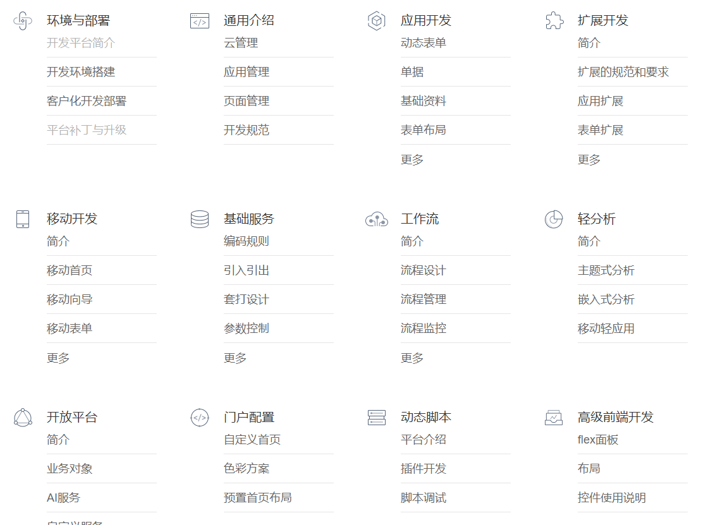
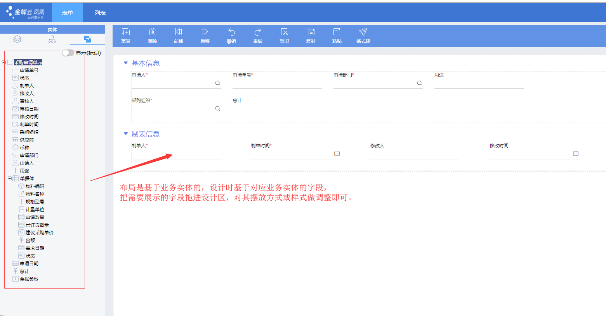

# 关于赋能中后台的思考

> 最近，随着组件市场项目逐步完成上线，我们也在思考，我们的平台如何进化，业界飞冰、云凤蝶等都在赋能中后台，我们也是可以做的，基于现有的平台，做更多的扩展，逐步完善整个体系，这篇文章主要是思考如何去赋能中后台。

## 对业界实践的思考

先看下业界的实践，飞冰、云凤蝶、还有 Lugia ，大家都提供了辅助前端开发的 IDE，以及辅助设计的 Sketch 插件，力图打通从需求、设计、前端整个流程。说实话，我没用过这个流程，因为一直有个疑问:

>设计已经设计了视觉效果，为什么还要参与需求？难道每个前端开发的页面，都要设计用 Sketch 去画一遍？

设计资源真是稀缺，想找个设计这么难，这个工作应该上产品去做。

我们也一直在想，是不是也要去做 Sketch 插件，然后让设计去给我们画UI？

## 做 ERP 的那几年

我想起自己做 ERP 的那几年，之前在用友工作过一段时间，后面也参与过几个 SAP 系统的实施，ERP 整个行业的成熟度很高，用友、金蝶、SAP 等 ERP 厂商都有自己的套平台，辅助开发 ERP 系统，ERP 系统无疑是很复杂的，比一般的中后台应用都很复杂。

用友的 UAP 平台，金蝶的云平台，SAP 的各种产品，都是平台化的，从数据库设计到UI设计，可以一站式完成所有的开发，提供标准产品，同时也能基于标准产品进行定制开发。

看一下金蝶官方文档列表：


涉及到东西很多，从基础环境、数据库、到UI设计，我又找了下表单设计的文档：



从左侧的数据实体拖拽字段到右侧表单区域，自动完成UI和模型的绑定。

这些 ERP 厂商的做法是从数据模型到 UI 的路径完成系统开发。

## 从 API 反推表单/列表/详情

云凤蝶有个功能，是从 API 反推表单、列表、详情，我觉得这个思路是对的，估计后面他们会从 DB 开始，从数据建模，到业务层代码生成，再到UI的视图模型，最后再到UI的创建。

从这个角度看，确实要有很多工作要做。

## 从 UI 开始还是从业务模型开始

我想当初从 Sketch 入手，应该更多的是从前端的角度来看问题的，如何让前端开发更顺畅，但是从整体来看，当我们设计一个系统的时候，其实是从数据库的设计开始的，一般都是遵从领域驱动设计的思想，先对业务系统进行建模，业务都在模型里，这就是为什么后端觉得自己最懂业务了，因为他们直接和这些业务模型打交道，前端接触的是被后端整理的模型，还有就是视图模型、交互模型。

但是在一般的互联网团队中，都是前后端分离的模式，就算是 BFE 模式，模型也是掌握在后端手里，所以后端需要给出模型的元数据信息接口，这样前端就可以更好的利用模型数据，构建 UI 了。

所以，对中后台系统，直接从 UI 入手，其实是挺难的，设计拖的是组件，生成的是 UI 布局代码，但是没有模型信息，也不能直接绑定到UI上，所以后面还是需要不少手动敲代码绑定模型的过程。

还有一些平台，希望直接拖拽细粒度的组件，创建系统，比如文本框、按钮等，但是涉及到数据绑定的问题都比较麻烦，以及组件间的交互，需要内嵌一些脚本，最后反而觉得不如直接上手写代码，因为平台主要就是做了布局。

所以，中后台应用，最好是从 模型 到 UI，掌握了模型，UI 可以做得更深入，不仅仅是布局，也包括数据绑定，以及一些增删改查的基础功能。

## 和 Serverless 结合

从用友、金蝶等公司的 ERP 平台看，基本都是基于 MySQL 等关系型数据库的，先利用工具建表，生成实体模型，后端服务，一般是用 Java 语言，最后是利用模型生成 UI。

但是现在对于前端来说，可使用 Serverless，平台提供建模工具，收集元数据信息，利用模型的元数据生成后端 js 代码，同时生成 UI 模型，最后是做 UI 的设计，生成前端的代码。

下面是 LeanCloud 的 Serverless 服务提供数据存储服务 JavaScript 代码：

```js
// 声明 class
var Todo = AV.Object.extend('Todo');

// 构建对象
var todo = new Todo();

// 为属性赋值
todo.set('title',   '工程师周会');
todo.set('content', '周二两点，全体成员');

// 将对象保存到云端
todo.save().then(function (todo) {
  // 成功保存之后，执行其他逻辑
  console.log('保存成功。objectId：' + todo.id);
}, function (error) {
  // 异常处理
});
```

这样代码完全是可以通过模型生成的。

利用平台的元数据信息，可以生成一系列从后端到前端的代码，后续前端可以在这个基础上做扩展，扩展的过程确保不修改生成的代码，将源码生成的流程加入到发布流程。

## 总结

本文主要是针对赋能中后台的思路进行了梳理，对比飞冰、云凤蝶 和 用友、金蝶等公司的方案，分析是从 UI 入手，还是从模型入手，对于中后台应用，对 UI 要求不高，或者 UI 有统一的视觉标准，那么从 模型 到 UI 的路径是可以大幅提效的。

最后，明年可以利用公司 Serverless 平台以及我们的可视化平台试试这个思路。
