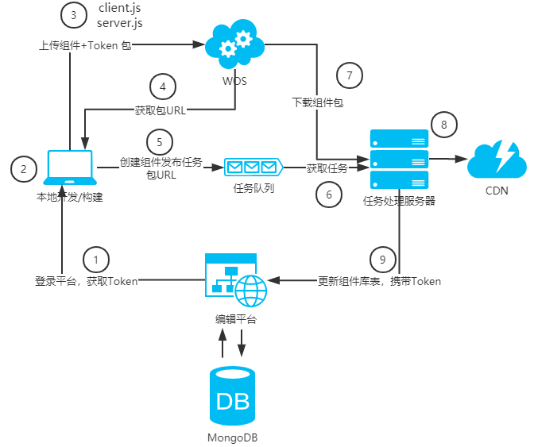
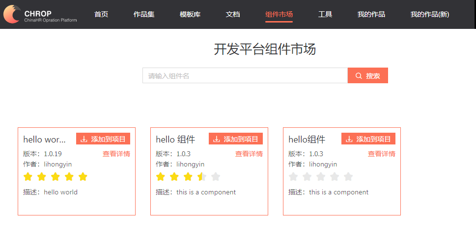
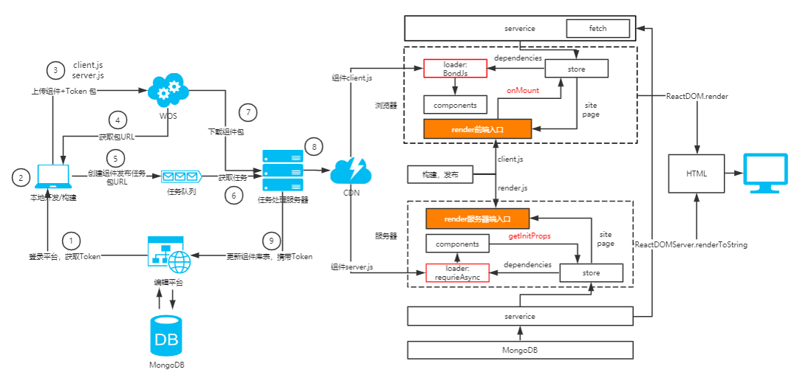

> 年底了，最近总结了我们编辑平台的技术实现，这应该19年最后一篇分享，之前的分享大家给了不少的鼓励，很感谢，这篇文章主要是讲系统中组件市场和同构直出的实现，上篇分享没有提及，因为还没发布上线，最近发布上线，也遇到不少问题，和大家分享一下。

## 前言

最近上线了组件市场，类似物料市场，这样，编辑平台的组件就可以自由的、无限的扩充了，编辑平台更像一个平台了，搭好架子，剩下的就是开发更多优秀的组件，或者深度集成业务的组件/模板/应用，类似云凤蝶的模板市场。

一期的组件是通用组件，写死到页面里的，但是影响了编辑平台的使用广度，二期组件市场是希望能拓展整个平台的使用广度，不单单是做定制页，还可以扩展到其他业务上，我相信是一定可以的。

组件市场类似 vscode 的插件市场，提供了一个开发脚手架，本地开发、调试，可以自由发布组件。

组件市场对同构直出有了新的需求，因为组件市场内的组件，也需要直出，以前组件是死的，只需要为 Server 端构建一份就可以了，但是组件市场是活的，又不能在服务器上部署所有的组件，这里也处理一下。

## 组件开发和发布


### 组件开发
组件需要构建两份，一份是client.js，用在浏览器内，一份是server.js，用在服务器端，使用 webpack 构建，浏览器端大家都熟悉，但是 node 端需要额外配置，下面是我的配置，供参考：

```js
const webpack = require('webpack');
const paths = require('./paths');

const env = 'production';
const babelOptions = {
    presets: [
        [
            "env",
            {
                "loose": true,
                modules: "commonjs",
                useBuiltIns: 'usage'
            }
        ],
        "stage-0",
        'react'
    ],
    plugins: [
        "transform-runtime",
        "transform-async-to-generator",
        "transform-object-assign",
        "transform-class-properties",
        "transform-es3-member-expression-literals",
        "transform-es3-property-literals",
        [
            'import',
            [{
                'libraryName': 'antd',
                'style': true
            }]
        ]
    ]
}
var server = paths.resolve('src/component/server.js');
var def = {
    mode: 'production',
    entry: {
        'server': server
    },
    output: {
        path: './dist',
        filename: '[name].js',
        publicPath: process.env.NODE_ENV === 'production' ? '$CDN$' : '',
        libraryTarget: 'commonjs'
    },
    module: {
        rules: [
            {
                test: /\.less$|\.css$|\.md/,
                use: [
                    'ignore-loader'
                ]
            },
            {
                test: /\.(js|jsx)$/,
                exclude: /(node_modules)/,
                use: [
                    {
                        loader: 'babel-loader',
                        options: babelOptions
                    }
                ]
            },
            {
                test: /\.(jpg|png|gif)$/,
                use: [{
                    loader: 'url-loader',
                    options: {
                        limit: 1,
                        name: 'img/[path][name].[ext]'
                    }
                }]
            }
        ]

    },
    externals: {
        'react': {
            commonjs: 'react',
            commonjs2: 'react'
        },
        'react-dom': {
            commonjs: 'react-dom',
            commonjs2: 'react-dom'
        },
        'redux': {
            commonjs: 'redux',
            commonjs2: 'redux'
        },        
    },
    resolve: {
        alias: {

        },
        extensions: ['.json', '.js', '.jsx']
    },
    target: 'node',
    plugins: [
        new webpack.DefinePlugin({
            'process.env.NODE_ENV': JSON.stringify(env),
            'File': {},
            'FileReader': {}
        }),
    ]
};
module.exports = def;

```
需要注意以下几点：

1. target 设置为 node
1. libraryTarget 设置为commonjs
1. library 不需要设置，导出模块的 default 字段就是组件
1. node 端不识别的文件，利用 ignore-loader 忽略掉
1. 利用 externals 排除不需要的包，在 node 端可直接获取，这个列表可能会很长
1. 利用 webpack.DefinePlugin 插件将浏览器端特有的对象忽略掉
1. publicPath 如果不确定，可以先加个替换符
1. css/less 被忽略了，组件内建议使用 css in js 方案，我们使用 Glamor，渲染时利用 Glamor 可以提取css注入到页面里

以上是构建时需要注意的事项，可能不同的场景有不同需要，仅供参考

### 组件打包

组件打包需要提供文件，描述组件的信息，比如组件的名称，描述，前端和服务器端的入口，以及编辑器，下面是一个示例：

结构参考了 package.json 文件，main 是前端入口，server是服务器端入口，editors 是组件对应的自定义编辑器列表，author 可以不用填，author 是用 Token 回填的。

```js
{
    "name": "hello-world",
    "title": "hello world 组件",
    "version": "1.0.19",
    "description": "hello world",
    "main": "component/client/index.js",
    "server": "component/server/index.js",
    "editors": [
        {
            "code": "text-editor",
            "name": "text-editor",
            "main": "editors/text-editor.js",
            "title": "编辑文本",
            "target": "_modal"
        }
    ],
    "author": "",
    "license": "ISC"
}
```

组件发布过程中会参考这个文件，提取对应的信息，入库。

### 组件发布

组件发布的过程是和 vscode 的插件发布很类似，也是参考 vscode 来做的。

这里梳理了一张组件发布的流程图：



组件发布的过程是异步的，本地打包好后，需要上传到云存储服务器，然后启动一个发布流程。

为了确定用户的合法，需要加入用户在平台的 Token，这样就知道是谁发布的组件，组件的拥有者是谁。Token 是利用 [jwt](https://jwt.io/) 来创建的，平台利用秘钥生成，同时利用秘钥解密，保存用户的相关信息。

组件任务发布到任务队列，任务服务器从任务队列取出任务，下载组件包，解压，将资源推送到 CDN 上，最后更新组件信息更新到平台，包括组件的版本信息、组件的入口等。

### 组件版本管理

组件版本参考了 npm 的版本管理，因为不需要那么精细的版本控制，我们只是做大版本的维度，为不同的大版本建立目录，覆盖发布，组件在大版本向后兼容，小版本仅作为参考。

这样，组件的发布流程 OK 了，仅供参考，组件的查询需要借助 MongoDB 的关键字索引。



看这个搜索好像有点意思^^，用户可以添加到组件到自己项目下使用。

## 同构直出

### 执行流程

看一张大图，花了好久画的，和前面的发布流程整合到一起了。




首先需要获取页面的数据，包括页面的结构数据，组件数据，页面依赖的组件列表，准备好 Store，以及渲染需要的组件列表。

浏览器和服务器端作为两个容器，执行环境是不同的，橙色的部分是前端的代码，也就同一结构的那部分，也是经过构建分别创建的两份 js。

前端和后端不同的部分，需要有对应的实现，这里类似适配器模式，比如网络请求，前端用 fetch，后端使用 node-fetch 做 polyfill ，组件的异步加载，前端是用了我们自己的加载器 BondJs，也可以用 RequireJS ，后端加载模块比较特殊，因为模块是 CDN上，需要先下载到本地，然后再 require，所以做了一个 requireAsync 加载模块。

代码参考：

```js
function fetchScript(url, destFolder) {
    console.log(`下载脚本：${url}`);
    return fetch(`${url}?v=${Math.random() * 1000}`)
        .then(function (res) {
            return new Promise((resolve, reject) => {
                const tarFile = path.resolve(destFolder, 'index.js');
                const dest = fs.createWriteStream(tarFile);
                dest.on('finish', () => {
                    console.log(`下载脚本成功：${tarFile}`);
                    resolve(tarFile);
                })
                dest.on('error', reject);
                res.body.pipe(dest);
            })
        });
}

async function requireAsync(url) {
    const folderName = `${new Date().getTime()}_${(Math.random() * 10000).toFixed(0)}`;
    const tarFolder = path.resolve(_SSR.tempFolder, folderName);
    const resPath = await fetchScript(url, tarFolder);
    const cmpPath = require.resolve(resPath);
    const cmp = require(cmpPath);
    console.log(`删除缓存：${cmpPath}`);
    delete require.cache[cmpPath]
    fs.rmdir(tarFolder, (err) => {
        if (!err)
            console.log(`删除目录：${tarFolder}`);
    });
    return cmp.default || cmp;
}

```

代码仅供参考，有问题不负责。

这里有个问题，组件市场的组件那么多，如果都在服务器端 require，那内存是不是要爆掉了，这里渲染完成以后，将对应的组件缓存清掉，为了避免频繁执行这个过程，给生成的 HTML 加上缓存处理。

### 组件的异步数据

如果希望组件的异步数据也没直出，参考 next.js ，给组件加了一个静态属性 getinitProps，服务器端变量所有组件的，如果有 getinitProps ，那就执行，准备好组件的属性。

服务器端怎么遍历页面的所有组件呢？一般是不可以的，但是这里页面组件数据被拆成两个结构，我们可以拿到一个页面依赖的所有组件，然后遍历执行 getinitProps，即便是嵌套在内部的子组件，也可以支持同构直出。

前端一般是 onMount 内执行数据加载逻辑，这一部分可以在 getinitProps 内实现。

后端是 Store 只有一个 reducer，就是根据组件 ID，更新组件的属性，准备好组件属性后，执行这个 reducer 。

```js
propList.map((prop) => {
    Store.dispatch({
        type: 'SET_COMPONET_PROPS',
        id: prop.id,
        props: prop.props
    });
});
```

组件列表和 Store 准备好，就可以执行同构的代码，生成 HTML了，利用 Glamor 抽取组件的 css，将 Store 内嵌到 模板，就可以输出 HTML 了。


## 总结

组件市场完成以后，我们希望能开发更多的特色组件，以及面向业务的组件，拓宽平台的应用场景，同时要不断优化编辑体验。

整个组件市场和同构直出的分享就到这了，基本上完成预定的目标，但是刚刚上线，还得经得住后期的考验，希望不断改进，不断成熟。


关于我们的可视化编辑平台可以参考文章：

[基于 React 的可视化编辑平台实践](https://zhuanlan.zhihu.com/p/94016600)
