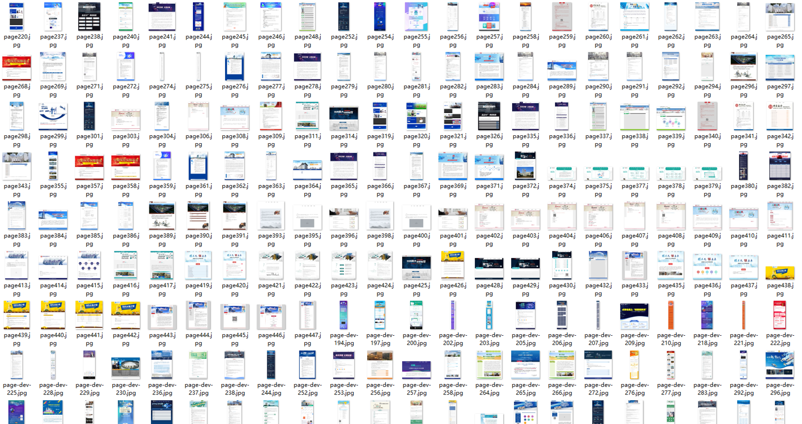
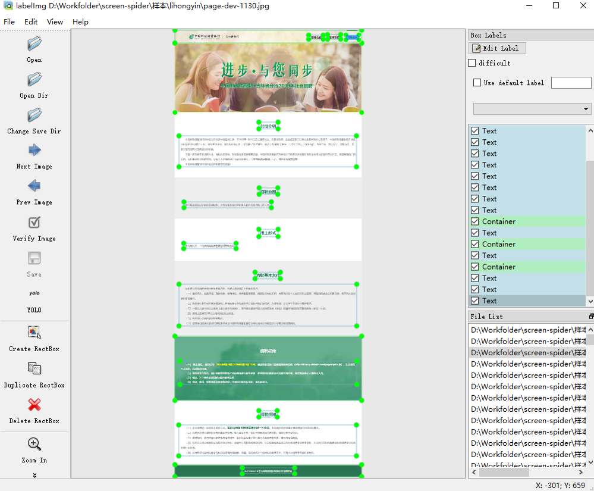
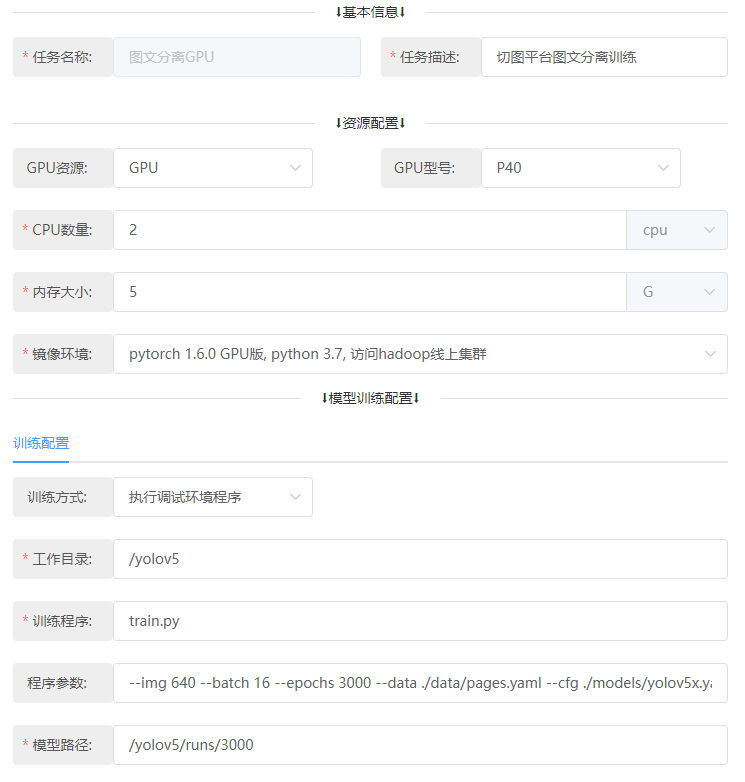
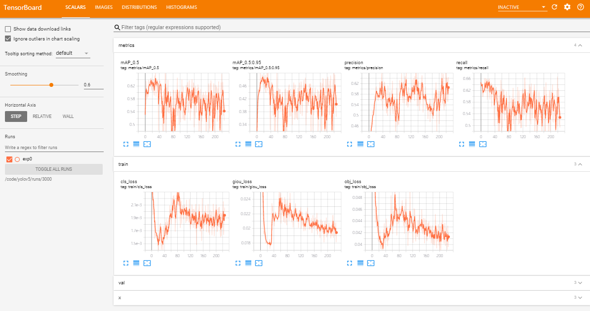
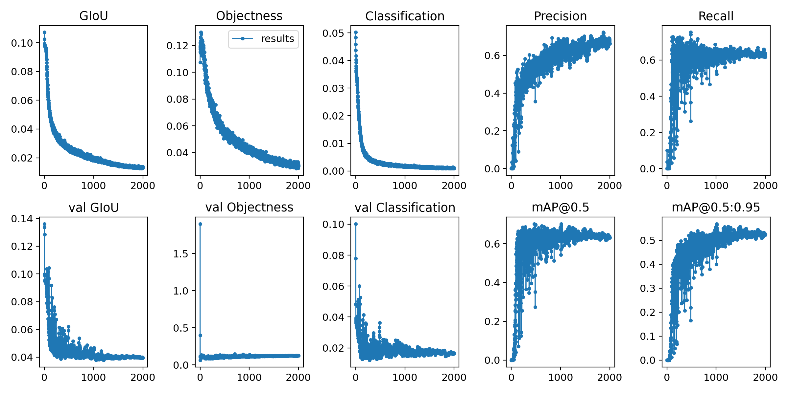
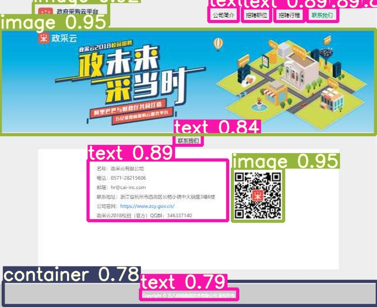
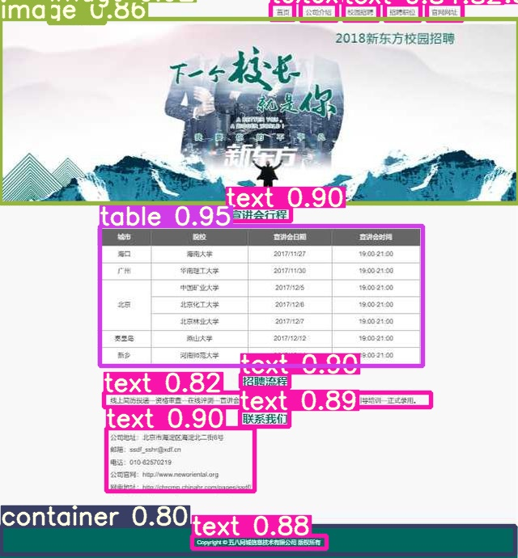

> 在线切图平台项目是前端通道的提效项目，希望能通过对设计稿的分析，将设计稿转成HTMl，我们尝试使用深度学习来自动识别图片中的文字和图片，之前本地PC上做了基于CPU的训练，但是基于 CPU 训练耗时太长，每次都要训练四五天，所有希望能利用上公司的 wapi人工智能平台，这篇文章记录使用平台的一些经验。


## yolov5是什么

YOLO 系列是深度学习目标检测领域里比较出众算法系列，最初是 facebook 的一位大牛的作品，目前总共有个五个版本，对它的具体了解可以参考下面的文章：

[写给小白的YOLO介绍](https://zhuanlan.zhihu.com/p/94986199)

简单说就是一个可以检测出图片中有哪些物体的算法模型，而且效率很高，可以实时视频检测。

参考下面的视频直观体验：

[YOLOv5视频体验](https://www.bilibili.com/video/BV1X54y1D7WX?t=169)

## 样本准备

我们准备了1000个线上站点的截图作为样本，利用了 `apify` 这个爬虫库，对每个网页截屏，`apify` 是基于 `puppeteer` 实现的，有兴趣可以研究下，贴段代码。

```js
const Apify = require('apify');

Apify.main(async () => {
    const requestQueue = await Apify.openRequestQueue();

    await requestQueue.addRequest({ url: ' http://you/site' });
    const pseudoUrls = [
        new Apify.PseudoUrl('http://allow.site.com/[.*]'),
    ];
    let i = 0;
    const crawler = new Apify.PuppeteerCrawler({
        requestQueue,
        handlePageFunction: async ({ request, response, page }) => {
            const status = response.status();
            const title = await page.title();
            console.log(`Title of ${request.url}: ${title}`);

            await page.setViewport({
                width: 1296,
                height: 300,
                deviceScaleFactor: 0.5,
            })
            await page.screenshot({ path: `../images/img-${i++}.jpg`, fullPage: true, quality: 100 });
            await Apify.utils.enqueueLinks({ page, selector: 'a', pseudoUrls, requestQueue });
            page.close();
        },
        maxRequestsPerCrawl: 999999,
        maxConcurrency: 10,
        gotoTimeoutSecs: 60
    });

    await crawler.run();
});

```
一千个样本截图：




## 样本标注

使用labelimg软件对样本进行标注，labelimg是基于Python+qt实现的，项目地址如下：

```
https://github.com/tzutalin/labelImg
```

windows 上可以参考 Windows + Anaconda 的安装方式。

图像界面如下：



样本标注会生成label文件，标识出每个框的类别，这里我们先确定了五个类别，包括：image,text,container,list,table

## CPU上跑起来

在 WPAI 平台上训练之前，先尝试在本地跑起来，尝试用 100 个样本进行训练，跑这个训练最好是用 linux 系统，因为最后都是要跑在linux 系统上，我用的 win10 自带的linux子系统，如果 linux 子系统安装不上，可以用虚拟机 VMWare 或者 VirtualBox 安装Ubuntu 或者 CentOS。

怎么跑训练数据，在 yolov5 的github 上有讲解：

```
https://github.com/ultralytics/yolov5/wiki/Train-Custom-Data
```

训练命令：

```
python train.py --img 640 --batch 5 --epochs 100 --data ./data/pages.yaml --cfg ./models/yolov5s.yaml --weights ./weights/best.pt --worker 1 
```

我在本地训练时遇到几个问题：

- batch 设置不对，这个 batch 参数是设置每一次批量处理几个图片，默认 batch 参数是16，但是用这个默认设置训练的话，可能会导致内存不足，最后设置但是 5 个
- workers 参数设置不对，worker 是设置 `maximum number of dataloader workers`，默认是 8，这个可能是和 cpu 的核数有关，有几个核设置几，简单了解了下，图片加载和处理是分开的，只有图片加载能供应上图片处理就没问题，比如将来用 GPU 训练，GPU 训练效率比较高，可能就要多开几个 workers 提高处理效率。
- epochs 参数，这个参数设置的训练的总轮数，是所有的样本跑完一次训练算作一轮，默认是 300 轮，看需要设置，开始的时候设置的很小，总是不见准确度提高，后来增加到20000多轮，才看到效果
- logdir 参数，设置权重文件输出目录，也包括监控数据输出目录
- weights参数，初始权重，可以为空

在 CPU 上训练，效率很低，100 个样本跑 2000 轮，大概需要四天左右，基本上能看到训练的结果，比如：


看到这个识别效果，很是兴奋啊！！

## WPAI平台离线训练

首先得先感谢 WAPAI 和 凤凰平台的团队，为我们提供了一个这样好的环境。

在本地测试没问题后，考虑在 WAPAI 上开展训练，WPAI 有 GPU 环境，希望能感受一下 GPU 的效率。

首先，建立调试环境，调试环境选择 `PyTorch1.6` 容器，将训练需要的程序、样本上传到调试环境，调试环境主要是进行一些测试，提供了 `jupyter` 环境，可以在线写 `Python` 脚本，`jupyter` 也提供了命令行工具，将 yolov5 的代码以及准备的好样本打包，利用 jupter 上传到对应的目录下。利用命令行解压，然后在调试环境跑一下试试。

然后，建立离线环境，离线环境提供多个平台，我们选择的是 PyTorch 单机版，下面是配置表单：



资源配置：

- GPU 资源，可以选择 CPU 或者 GPU，GPU 可以选择 K40 和 P40，我们选择 P40，因为PyTorch自从1.3以后，不再支持K40了
- CPU梳理，选择 2 个
- 内存 5 G
- 镜像环境选择 PyTorch1.6 GPU版

模型训练配置：

- 训练方式：选择执行调试环境程序
- 工作目录：这个目录是调试环境内设置的目录，是在 jupyter 中看到目录，不是系统中目录的绝对路径，jupyter 的的工作目录默认是 /code ，但是这里不能设置为/code/yolv5
- 训练程序：是相对工作目录的文件路径
- 程序参数：这里是传给训练程序的参数，batch 设置为16，16 张图作为一个批次，worker位置为2，logdir 单独指定一个目录，作为日志和权重文件输出目录
- 模型路径：这个模型路径是模型生成的路径，后续训练结束会将这个目录打包提供下载，设置为和logdir一个目录。

其他配置：
- tensorboard配置,tensorboard提供了对训练过程的可视化监控，将 tensorboard logdir 设置为前面的 logdir 即可。

设置好以后，就可以启动了，启动之初会安装依赖的包，安装完成后，启动训练。

每次运行，都会新建一个容器环境，所以要重新安装依赖的包，这里或许可以优化一下。

使用 GPU 训练相当的快，之前一个批次 5 张图，需要 15 秒，现在一个批次 16 张图，只需要 2秒。训练 2000 轮不到一天，

下面是 tensorboard 的监控图：




## 训练结果

训练结束后，可以看到训练的结果数据：



这里面主要看 `Precision` 和 `Recall` 这两个指标：

- `Precision` 是准确率，预测正确的数量占总共预测结果的比例
- `Recall`是召回率，或者查全率，是预测正确的数量占总共样本的比例

本次训练 2000 轮，准确率能达到 68%，也就是检测结果中，有 68% 是正确的，召回率 60% ，准确的结果占总样本 60%。

这个准确率是还是有提升空间，达到 90% 以上是我们的目标。

## 验证

验证命令：

```
python detect.py --source ./inference/images/ --weights yolov5s.pt --conf 0.4
```

- source 设置图片的来源
- weights 设置训练生成的权重文件
- conf 设置检查的阈值，高于这个阈值的都显示出来

在测试集合上跑一下，贴几个检查结果：






从结果来看，大部分结果是符合预期的，效果还不错。

## 后续规划

后续主要的目标提供准确率，增加一些样本数量，提供训练的轮数，然后将检测程序部署到线上提供服务。

虽然依靠深度学习可以检测出图片的目标区域，但是这个不是精确的，框选的范围和实际范围是有误差的，后续会通过其他的手段校准这个框。

## 总结

本文大致梳理了最近采用 `yolov5` 实现图片目标检测的过程，过程还是比较曲折的，毕竟对深度学习不太了解，前期要补课，了解神经网络相关的基础原理和概念，后期才动手操作，关于深度学习，目前业界已经有比较成熟的平台了，如果想做工程，可是动手试试，简单数字识别、物体识别、图像分类等任务都可以做到，对算法深度学习和优化，这个应该是需要算法专家来做了，还好公司大牛可以咨询，每次需要问题都能改指个道。

最后，感谢信安 的 段胜业，AI Lab 的陈兴振、陈泽龙，后面还要麻烦你们，多谢！
