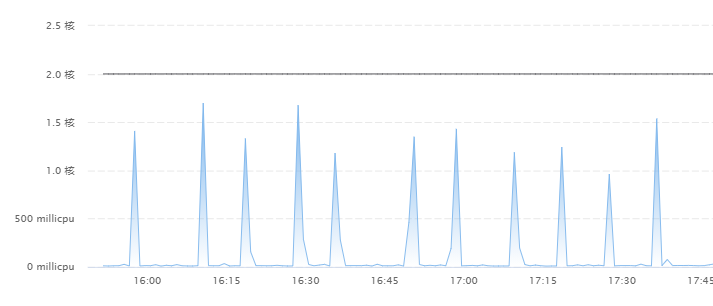
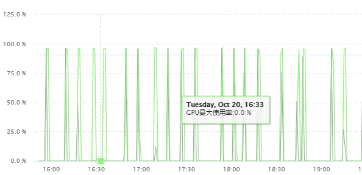
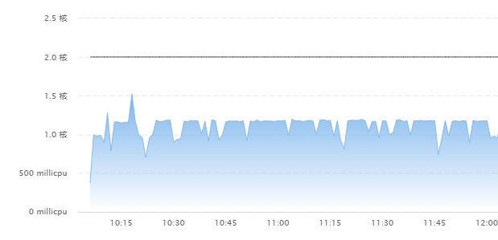
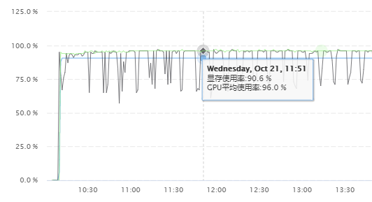

# yolov5训练性能优化

> 在利用人工智能平台进行yolov5训练过程中，遇到性能问题，汇总并总结一下

## 发现问题

之前在利用人工智能平台训练的时候，数据量比较小，只有100或200个样本，并没有发现性能问题，最近在尝试400个样本的训练，发现性能变差，每一轮时间明显变长，大概10分钟左右，正常每一轮1分钟不到。

通过资源监控，发现CPU和GPU的监控图变成下面这样：

CPU监控图


GPU监控图


查看之前的监控图：

CPU监控图


GPU监控图



## 定位问题

很明显，CPU 和 GPU 都没有得到充分的利用，一般来说，出现这种情况，很可能是IO慢导致的。

之前的监控图比较平滑，IO 操作没有表现出瓶颈，咨询了人工智能平台专家陈兴振和陈泽龙，建议我在程序里打上日志，看看哪里耗时比较长，开始我以为是平台的问题，因为之前的训练都比较顺利，没有出现性能问题，

打上日志以后，确实是IO操作导致的，原因是TensorBoard写数据和保存模型数据耗时比较长，最长要上百秒时间，每一轮更新，时间都耗在这种IO操作上。

## 解决问题

通过分析代码，通过一下三个方面解决问题：

## TensorBoard 参数

查看了一些相关文档，针对 TensorBoard 的实例化参数进行了调整，SummaryWriter 是 TensorBoard 的 Writer 类，通过这个类的实例写数据到磁盘，参数如下：

```
log_dir (string): Save directory location. Default is
    runs/**CURRENT_DATETIME_HOSTNAME**, which changes after each run.
    Use hierarchical folder structure to compare
    between runs easily. e.g. pass in 'runs/exp1', 'runs/exp2', etc.
    for each new experiment to compare across them.
comment (string): Comment log_dir suffix appended to the default
    ``log_dir``. If ``log_dir`` is assigned, this argument has no effect.
purge_step (int):
    When logging crashes at step :math:`T+X` and restarts at step :math:`T`,
    any events whose global_step larger or equal to :math:`T` will be
    purged and hidden from TensorBoard.
    Note that crashed and resumed experiments should have the same ``log_dir``.
max_queue (int): Size of the queue for pending events and
    summaries before one of the 'add' calls forces a flush to disk.
    Default is ten items.
flush_secs (int): How often, in seconds, to flush the
    pending events and summaries to disk. Default is every two minutes.
filename_suffix (string): Suffix added to all event filenames in
    the log_dir directory. More details on filename construction in
    TensorBoard.summary.writer.event_file_writer.EventFileWriter.
```

其中 max_queue 和 flush_secs 这两个参数负责控制什么时候写硬盘，max_queue 是数据缓存的最大数据，flush_secs 是数据缓存的最大时间， max_queue 默认 10，flush_secs 默认是 2 分钟。

可以看出，max_queue 和 flush_secs 的默认设置不合理，所有增大了 max_queue 和 flush_secs，这样 TensorBoard 就不会频繁写磁盘了

## 调整 nosave 参数

权重文件保存也会花费比较久的时间，每个权重文件大到上 G 的大小，磁盘操作很耗时，通过查找 yolov5 的训练参数，发现了nosave 参数，这个参数控制了是否每轮训练都保存权重文件到磁盘，默认值是 False，加上 nosave 参数，就不会再频繁写磁盘了，会在最终训练结束将权重写到磁盘上。

## 调整 notest 参数

notest 参数也可以加上，这个参数控制每轮训练是否在验证集上测试效果，加上以后就不会每轮都去测试，节省了很多时间。

## 总结

问题最终解决，看来还是要好好读下 yolov5 的代码，梳理大致的流程，这样利于解决问题，跨行做深度学习，比较难，慢慢来。。
